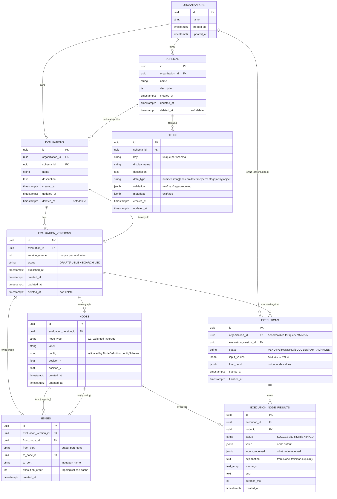

# ERD — Entity Relationship Diagram

> Mermaid ER diagram for the criteria-system-v3 database.
> All tables live in the `public` schema of PostgreSQL. All `organization_id` columns enforce multi-tenancy at the query level (see ADR-0005).

---

## Diagram

---

## Index Strategy

| Table | Index | Reason |
|-------|-------|--------|
| organizations | PRIMARY KEY (id) | implicit |
| schemas | (organization_id) | list schemas for an org |
| schemas | (organization_id, deleted_at) | list schemas excluding deleted |
| fields | (schema_id, key) UNIQUE | enforces key uniqueness, also covers "list fields of schema" |
| fields | (schema_id) | covers the UNIQUE index above; explicit for clarity |
| evaluations | (organization_id) | list for org |
| evaluations | (organization_id, deleted_at) | list for org excluding deleted |
| evaluations | (schema_id) | "what evaluations use this schema?" |
| evaluation_versions | (evaluation_id, version_number) UNIQUE | enforces uniqueness, covers "list versions" |
| evaluation_versions | (evaluation_id) | covers the UNIQUE index above |
| evaluation_versions | (evaluation_id, status) | "find currently PUBLISHED version" |
| nodes | (evaluation_version_id) | load full graph of a version |
| edges | (evaluation_version_id) | load full graph of a version |
| edges | (from_node_id) | "what edges leave this node?" |
| edges | (to_node_id) | "what edges arrive at this node?" |
| executions | (organization_id) | list executions for org |
| executions | (evaluation_version_id) | "history of this version" |
| executions | (organization_id, status) | filter by status in dashboard |
| execution_node_results | (execution_id) | load trace |
| execution_node_results | (node_id, status) | "how often does this node fail?" (analytics) |
| execution_node_results | (node_id) | covers the composite above |

---

## Cascade Behavior

| FK | onDelete | Reason |
|----|----------|--------|
| fields.schema_id → schemas.id | CASCADE | Fields have no meaning without their schema |
| evaluation_versions.evaluation_id → evaluations.id | CASCADE | A version without its parent is meaningless |
| nodes.evaluation_version_id → evaluation_versions.id | CASCADE | Node rows belong to the version's graph |
| edges.evaluation_version_id → evaluation_versions.id | CASCADE | Edge rows belong to the version's graph |
| edges.from_node_id → nodes.id | CASCADE | Edge can't survive without endpoints |
| edges.to_node_id → nodes.id | CASCADE | Same |
| execution_node_results.execution_id → executions.id | CASCADE | Trace rows belong to their execution |
| execution_node_results.node_id → nodes.id | RESTRICT | Don't lose history when a node is deleted (but node deletion is only allowed on DRAFT — see versioning rules) |
| schemas.organization_id → organizations.id | RESTRICT | Don't accidentally lose an org's data |
| evaluations.organization_id → organizations.id | RESTRICT | Same |
| evaluations.schema_id → schemas.id | RESTRICT | Evaluation should be explicitly deleted, not orphaned |
| executions.organization_id → organizations.id | RESTRICT | Same |
| executions.evaluation_version_id → evaluation_versions.id | RESTRICT | Versioning must be explicit (we don't want delete-version to wipe execution history) |

**Note on `RESTRICT` for Organization**: deleting an Organization is out of scope. The cascade rules ensure no accidental data loss if org deletion is ever added.

---

## Soft Delete Pattern

Tables with `deleted_at timestamptz NULL`:
- `schemas`
- `evaluations`
- `evaluation_versions`

Repositories always include `where: { ..., deletedAt: IsNull() }` for read paths.

When a Schema is soft-deleted, **all child Evaluations and EvaluationVersions are soft-deleted in the same transaction** (see ADR-0003 / transaction boundaries in the architecture doc § Transaction Boundaries).

Tables without `deleted_at` (hard delete or append-only):
- `organizations` — out of scope to delete
- `fields` — cascade-deleted with parent schema (only happens during hard operations)
- `nodes`, `edges` — cascade-deleted with parent version
- `executions`, `execution_node_results` — append-only, purged by retention policy (out of scope for v1)

---

## Cardinality Verification

| Relationship | Type | Notes |
|--------------|------|-------|
| Organization → Schema | 1 : 0..N | An org may have zero schemas |
| Organization → Evaluation | 1 : 0..N | An org may have zero evaluations |
| Organization → Execution | 1 : 0..N | Denormalized for query efficiency |
| Schema → Field | 1 : 1..N | A schema MUST have at least one field to be usable |
| Schema → Evaluation | 1 : 0..N | A schema with no evaluations is allowed (just-defined) |
| Evaluation → EvaluationVersion | 1 : 1..N | An evaluation MUST have at least one version (the initial DRAFT) |
| EvaluationVersion → Node | 1 : 1..N | A version MUST have at least one node (an Output node at minimum) to be valid |
| EvaluationVersion → Edge | 1 : 0..N | Edges are optional (a single-node graph is valid) |
| EvaluationVersion → Execution | 1 : 0..N | A version may never have been executed |
| Execution → ExecutionNodeResult | 1 : 1..N | Each execution produces at least one result (one per node in the version) |

---

## Denormalization Justification

**Why `executions.organization_id`?**

`executions` is queried heavily for org-scoped dashboards ("list my recent executions"). Without the denormalized column, every query joins `executions → evaluation_versions → evaluations → organization_id` — three joins for the most common access path.

The denormalization is safe because:
1. `organization_id` on `evaluations` never changes (no org transfer feature).
2. The execution captures `organization_id` at creation time. If a row's organization were later re-assigned, the execution would still attribute correctly to the original tenant — which is the right behavior.

**Why `execution_versions.organization_id` is NOT denormalized?**

Versions are deeply nested. Every version query that needs the org filter already touches `evaluations`. Denormalizing here adds a column with no real query benefit.

---

## Migration Plan

### Migration 001 — Initial Schema

Creates all tables above in dependency order:

1. `organizations`
2. `schemas`
3. `fields`
4. `evaluations`
5. `evaluation_versions`
6. `nodes`
7. `edges`
8. `executions`
9. `execution_node_results`

For each table:
- Create table with all columns and constraints.
- Create indexes.
- Create foreign keys with `onDelete` matching the table above.

### Migration 002 — Seed Data (TikTok Creator)

Idempotent seed:
- 1 organization (`Acme Creators`).
- 1 schema (`TikTok Creator`) with 4 fields.
- 1 evaluation (`Creator Quality Score`).
- 1 evaluation version (`v1`, status PUBLISHED).
- 7 nodes: 3 input, 1 normalize, 1 weighted_average, 1 threshold, 1 output.
- 7 edges (per the reference graph).
- 0 executions (none yet at seed time).

Seed file lives in `src/infrastructure/database/typeorm/seeds/tiktok-creator.seed.ts` and is runnable via `npm run seed`.

---

## Future Migrations (planned but not in v1)

| Migration | Purpose | Blocking? |
|-----------|---------|-----------|
| Add `users` table | Foundation for RBAC in v2 | No — query-level filter already enforces org isolation |
| Add `domain_events` outbox | Guarantees event delivery if v2 needs it | No — current two-phase pattern is correct |
| Add `users.organization_id` | RBAC anchor | No |
| Add `executions.tenant_metrics` materialized view | Dashboard analytics | No — current `execution_node_results` table already supports the queries |

None of these change the table set above; they add to it. The v1 schema is forward-compatible.
